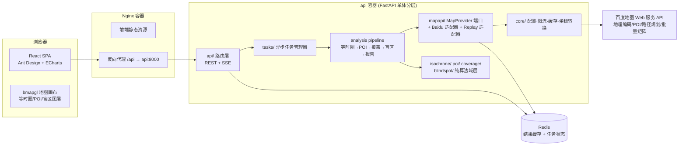
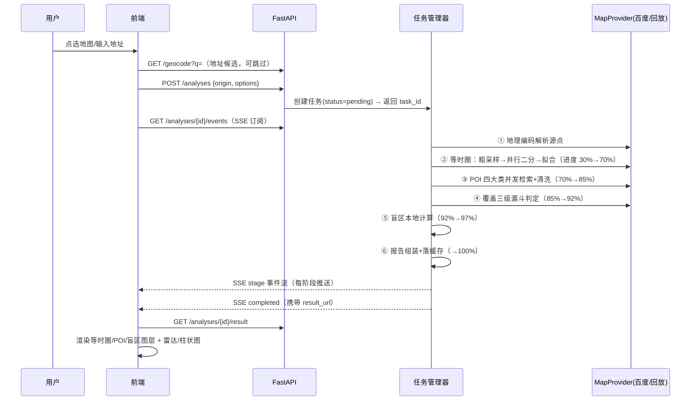

# 《"15 分钟生活圈"智能体检与规划助手》技术实现方案

> 依据：`docs/01-需求分析报告.md`
> 文档定位：可落地技术方案（选型论证、架构、算法、模块、流程、工程规范）
> 日期：2026-09-18

---

## 1. 技术选型与论证

### 1.1 选型决策总表

| 层 | 选型 | 版本基线 | 决策理由 | 备选（否决原因） |
|----|------|---------|---------|----------------|
| 产品形态 | **Web 应用**（响应式 SPA） | — | 评审演示友好、CI/CD 易配、无上架审核 | 小程序（审核流程不可控、地图组件受限） |
| 后端语言 | **Python** | 3.12 | 空间计算生态碾压：shapely/scipy/cKDTree；asyncio 契合 API 密集 IO | Node.js（空间计算库弱，凹包/插值需自研） |
| Web 框架 | **FastAPI** | 0.110+ | 原生异步、pydantic v2 类型安全、自动 OpenAPI 文档 | Django/Flask（同步模型需额外改造） |
| HTTP 客户端 | **httpx (AsyncClient)** | — | 连接池、超时精细控制、与 pytest/respx mock 无缝 | aiohttp（API 略糙） |
| 几何计算 | **shapely** + **alphashape** | 2.0+ | 多边形有效性/联合/缓冲；凹包拟合 | 自研（没必要） |
| 插值 | **scipy** (griddata / cKDTree) | — | 时间场插值 + 盲区最近设施查询（向量化，零 API 成本） | — |
| 缓存/状态 | **Redis** | 7.x | API 结果缓存 + 异步任务状态；docker-compose 一键起 | SQLite（并发写受限）；Celery（过重） |
| 前端框架 | **React + TypeScript** | 18 / 5.x | 生态、类型安全、团队可维护性 | Vue 3（同等可行，非关键差异） |
| 地图 | **百度地图 GL JS API (bmapgl)** | — | 命题指定百度底座；GL 渲染性能好 | — |
| 图表 | **ECharts** | 5.x | 热力图/柱状图/雷达图全内置，中文文档 | — |
| UI 组件库 | **Ant Design** | 5.x | B 端工具气质契合（表单、进度、布局） | — |
| 构建 | **Vite** | 5.x | 秒级 HMR，产物优化开箱即用 | — |
| 部署 | **Docker Compose** | — | 评审"一键跑通"硬性要求 | K8s（过重） |
| CI/CD | **GitHub Actions**（可镜像 Gitee Go） | — | 命题认可；矩阵任务成熟 | — |

### 1.2 关键选型的深入论证

**为什么后端必须是 Python**：本系统的核心壁垒在几何算法层——等时圈边界拟合（非凸多边形、自交修复、飞地 MultiPolygon）、时间场空间插值、盲区栅格聚合。这些在 Python 中是"调库 + 纯函数"的成熟路径，在其他语言中是"自研 + 踩坑"路径。API 密集调用的性能瓶颈在**网络往返而非计算**，asyncio + 连接池足以打满任何配额。

**为什么单体分层而非微服务**：系统只有一个业务域（分析流水线），无独立扩缩容需求。评审要求"Docker 快速跑通"——3 容器（nginx/前端、api、redis）已是上限。模块边界用**包结构与依赖规则**保证（见 §4），未来需要拆分时沿接口切割即可。

**端口-适配器隔离地图 API**（工业级关键设计）：定义 `MapProvider` 协议接口，百度实现 `BaiduMapProvider` 是其中一个实现，另有 `ReplayProvider`（读取录制的真实响应快照）。收益：① CI 与演示模式零配额消耗；② 单元测试确定性；③ 若比赛方切换地图供应商（高德/腾讯同赛道通用），换适配器即可。

---

## 2. 总体架构

### 2.1 架构图



### 2.2 分层依赖规则（强约束，CI 检查）

```
api/(路由) → tasks/(编排) → 域层(isochrone|poi|coverage|blindspot) → mapapi/(端口)
                                                    ↘ core/(通用基础) ↗
```

- **依赖只能向左**（上层依赖下层）；域层之间通过 pipeline 编排协作，不横向 import；
- `mapapi/` 是唯一允许发起外部 HTTP 的位置（限流/重试/缓存全部收口在此）；
- 域层算法全部为**纯函数**（输入坐标/几何，输出几何/数值），不触碰 IO —— 这是可测性与可读性的根基。

### 2.3 坐标系规范

- **全链路内部规范坐标系：BD09**（百度体系原生，避免双重转换误差）；
- `core/coords.py` 提供 WGS84/GCJ02 → BD09 纯算法转换（公开公式，零 API 成本）；
- 所有对外接口的坐标字段必须显式携带或默认声明 `crs: "bd09"`；
- 前端地图拾取坐标即 BD09，直通后端，无转换损耗。

---

## 3. 核心算法设计

### 3.1 等时圈生成引擎（创新核心，对应评分 30% 维度）

#### 3.1.1 算法总纲：并行二分扇形采样 + 时间场双重表达

传统方案（OSM 路网 + Dijkstra）被命题排除。本方案以**路径规划/批量矩阵 API 为黑盒测时探针**，三阶段推演等时圈：

**阶段 A — 扇形粗采样（构建时间场骨架）**

- 以中心点为极点，`N=16` 方向（22.5° 间隔）发射采样射线；
- 每方向布设 `M=4` 个距离档探测点（300/600/900/1200 m，覆盖 15 min 步行量级，可配）；
- 共 64 个 OD 对，用**批量距离矩阵**（1 源 × 多目的地）打包查询：按配置的批量上限（如 50）分片，**2~3 次 API 调用**完成；
- 产出：64 个 `(方向θ, 距离d, 实测耗时t)` 三元组。

**阶段 B — 并行二分细化（临界点收敛）**

- 每方向定位耗时跨越 `T=15min` 的相邻距离档 `(d_lo, d_hi)`；
- 对全部 16 个方向**同时**执行二分迭代（3 轮，区间收敛至 ~50 m）；
- 关键优化：每轮迭代把 16 个方向的探测点**攒批成 1 次矩阵调用**（而非 16 次单路规划）；
- 3 轮 × 1 次 ≈ **3 次 API 调用**收敛全部方向；
- 不可达处置：方向上出现"无路线"响应 → 标记该方向"受阻"（河流/围墙/封闭区），记录最近可达点，用于解释圈形凹陷。

**阶段 C — 边界拟合 + 双重表达**

1. **极坐标样条拟合**：各方向临界点 `(θ_i, d_i)` 在角度域做 Catmull-Rom 平滑 → 闭合多边形；受阻方向用相邻方向插值补齐并**降低置信度标记**；
2. **时间场等值线**（交叉验证 + 多级圈免费获得）：64 + 48 = 112 个测时点构建散点时间场，`scipy.interpolate.griddata` 线性插值到网格，提取 5/10/15 min 等值线 → 多级嵌套等时圈；
3. **几何修复**：shapely `make_valid` 处理自交；等值线闭合性校验；飞地检测（相邻方向临界距离突变 > 2× 中位数 → 补采 2~3 个探针判定是否为经天桥/桥梁连通的独立可达区）→ 输出 `MultiPolygon`；
4. 两法结果叠加比对，偏差 > 阈值的区段触发**局部加密重采样**（自适应精度，配额内闭环）。

#### 3.1.2 伪代码

```text
func compute_isochrone(origin, T=15min):
    probes = [(θ_i, d_j) for i in 1..16 for j in (300,600,900,1200)]     # 阶段A
    times  = batch_matrix(origin, probes)          # 2~3 次矩阵调用（带缓存/降级）
    field  = TimeField(probes, times)              # 散点时间场

    for round in 1..3:                             # 阶段B：并行二分，攒批
        bracket = per_direction_bracket(field, T)  # 每方向的 (d_lo, d_hi)
        mids    = [midpoint(b) for b in bracket]
        times   = batch_matrix(origin, mids)       # 1 次矩阵调用覆盖 16 方向
        field.update(mids, times)

    polygons_spline  = polar_spline_fit(critical_points(field, T))       # 阶段C
    polygons_contour = contour_extract(field.grid(), levels=[5,10,15])
    result = reconcile(polygons_spline, polygons_contour)  # 比对+局部加密
    return make_valid(result)   # MultiPolygon + 每圈 confidence + api_stats
```

#### 3.1.3 API 预算表（单次分析全流程）

| 步骤 | 调用方式 | 次数 |
|------|---------|------|
| 地理编码（地址→坐标） | 单次 | 0~1 |
| 等时圈阶段 A（64 OD） | 批量矩阵 ×2~3 | 2~3 |
| 等时圈阶段 B（48 OD） | 批量矩阵 ×3 | 3 |
| POI 检索（4 大类 × 分页） | 单类分页 | 8~16 |
| 覆盖边缘带精判（≤30 设施） | 批量矩阵 ×1~2 | 1~2 |
| **合计** | | **≈15~25 次**（缓存命中时趋近 0） |

> 对比朴素方案（逐 POI 逐方向路径规划，300+ 次）：**调用次数降低一个数量级**——直接命中评分细则"批量距离矩阵/并发策略显著降低计算耗时"。

#### 3.1.4 误差控制

- 采样网格误差上界：二分收敛 50 m ≈ 步行 40 s，等时圈边界水平误差 ≤ 半个采样间距；
- 拟合vs等值线双法偏差 > 100 m 的区段自动加密（配额护栏内）；
- 每个多边形携带 `confidence`（采样密度 + 双法一致性归一化），前端以描边样式区分——评审可感知的严谨性。

### 3.2 POI 采集与覆盖判定

**采集**（`poi/` 模块）：
- 4 大类 → 百度 POI 检索类目/关键词映射表（`config/poi_taxonomy.yaml` 驱动，非硬编码）；
- 圆形区域检索（半径 = 最大采样半径 1.3 km），**翻页聚合**至无更多页（单页 20 条）；
- 清洗管道（纯函数链，可单测）：同名+30 m 内聚类去重 → 类目白名单过滤（剔除"医药公司/批发市场"等噪音）→ tag 归一化到四大类。

**覆盖判定**（`coverage/` 模块，三级漏斗控制成本）：
1. **几何粗筛**（零成本）：设施点落在 15 min 等时圈外接多边形之外 → 直接判"圈外"；
2. **时间场插值估算**（零成本）：圈内点用 §3.1 时间场直接插值出估算耗时 `t̂`；
3. **边缘带精判**（API 成本封顶 30 个）：`t̂ ∈ [13, 17] min` 的边缘带设施，批量矩阵实测定论；
- 产出：每设施 `est_walk_time / in_circle / confidence`，分类统计（数量、可达率、平均耗时、评分 0~100）。

### 3.3 盲区识别算法（对应评分 40% 硬指标）

**全本地计算，零 API 成本**（向量化的性能优势展示点）：

1. 研究区域 = 中心点 1.5 km × 1.5 km，栅格化 100 m（225 格）；
2. 对三类关键设施（菜市场/药店/小学）分别建 `cKDTree`，向量化求每格中心到最近设施**直线距离**（默认口径，命题字面）；
3. 距离 > 1 km 的栅格标记缺失该类；三类缺失可叠加（严重度分级）；
4. 相邻同缺失类型栅格 8 邻接聚类 → shapely `union` + `buffer(50m)` 平滑 → 灰色多边形；
5. 可选增强：对盲区质心抽样做路网测时验证，报告双口径差异（文档中显式声明口径——严谨性加分项）。

### 3.4 限流、容错与降级（对应评分 30%）

**统一收口在 `mapapi/` 适配器内部，域层完全无感：**

| 机制 | 实现 | 细节 |
|------|------|------|
| 限流 | 每 API Key 独立令牌桶（asyncio 原生实现） | QPS/突发值配置化（默认保守 5 QPS），排队不丢弃 |
| 重试 | tenacity 指数退避 + 抖动 | 仅对超时/5xx/限流码重试，≤3 次；参数错/无路线不重试 |
| 熔断 | 连续失败计数器 | 打开后 30 s 内快速失败直接走降级链 |
| 缓存 | Redis TTL 7 天 + 进程内 LRU(1000) | Key = 规范化参数哈希（坐标取整 6 位小数）；**POI 与测时结果分别缓存** |
| 降级链 | 三级自动回退 | 批量矩阵失败 → 逐条路径规划 → 直线距离 × 经验系数(1.3) 估算并**标注低置信度**；POI 为空 → 显式报告"该类 0 个"而非报错 |
| 演示模式 | `ReplayProvider` + 固化快照 | `DEMO_MODE=1` 全链路零配额，评审演示与 CI 复现的保底 |

**配额护栏**：每次分析任务注入 `QuotaBudget`（默认 40 次调用上限），超限即降级至插值估算模式并在报告中声明——保证任何情况下演示不中断。

---

## 4. 模块划分

### 4.1 后端包结构

```
backend/
├── app/
│   ├── core/                     # 通用基础层
│   │   ├── config.py             # pydantic-settings，全部配额/阈值集中可配
│   │   ├── coords.py             # WGS84/GCJ02↔BD09 纯函数转换
│   │   ├── ratelimit.py          # 令牌桶
│   │   ├── cache.py              # Redis + LRU 两级缓存抽象
│   │   └── logging.py            # structlog JSON 日志 + trace_id
│   ├── mapapi/                   # 端口-适配器（唯一出站点）
│   │   ├── provider.py           # MapProvider 协议（协议定义即文档）
│   │   ├── baidu/                # 地理编码/POI/路径规划/矩阵 + 限流重试降级
│   │   └── replay/               # 快照回放实现（CI/演示）
│   ├── isochrone/                # 等时圈域（纯算法）
│   │   ├── sampler.py            # 扇形采样 + 并行二分
│   │   ├── field.py              # 时间场构建与插值
│   │   ├── fitter.py             # 样条拟合/等值线提取/几何修复
│   │   └── engine.py             # 编排，产出 IsochroneResult
│   ├── poi/                      # 采集→清洗→归一化 管道
│   ├── coverage/                 # 三级漏斗覆盖判定 + 评分
│   ├── blindspot/                # 栅格化 + KDTree + 聚合
│   ├── report/                   # 报告组装（I/O 模型，无算法）
│   ├── tasks/                    # 异步任务管理器（状态机 + 进度事件）
│   ├── api/                      # FastAPI 路由（薄层，只做校验与转发）
│   └── models/                   # pydantic v2 领域模型（唯一 schema 源）
├── tests/
│   ├── unit/                     # 域层纯函数（无 IO，毫秒级）
│   ├── integration/              # respx mock 百度 API（异常矩阵）
│   └── fixtures/replays/         # 录制的真实 API 响应快照
├── pyproject.toml                # ruff + mypy + pytest 配置内聚
└── Dockerfile
```

**划分逻辑三原则**：① 按**业务域**垂直切分（isochrone/poi/coverage/blindspot），不按技术横切；② **算法与 IO 严格分离**（域层纯函数 ↔ mapapi 唯一出站口）；③ **配置驱动一切外部约束**（配额/批量上限/类目映射集中在 config + yaml，换环境零改码）。

### 4.2 前端结构

```
frontend/src/
├── api/                          # axios 封装 + SSE 订阅器
├── stores/                       # zustand：analysisStore（任务态）/ mapStore（图层态）
├── components/
│   ├── map/                      # 地图画布 + 图层组件
│   │   ├── IsochroneLayer/       # 多级圈渐变多边形（bmapgl GeoJSON 支持）
│   │   ├── FacilityLayer/        # 分类打点 + >300 点自动聚合
│   │   ├── BlindspotLayer/       # 灰色多边形 + 缺失类型标签
│   │   └── OriginPicker/         # 点选/地址搜索双入口
│   ├── charts/                   # ECharts 封装：RadarScore/BarCount/GaugeOverall
│   └── report/                   # 报告布局 + 导出（图片/PDF/JSON）
├── pages/AnalysisPage/           # 主工作台（地图 + 侧栏报告）
└── hooks/                        # useAnalysisTask（创建/订阅/竞态取消）
```

---

## 5. 执行流程

### 5.1 分析任务时序



### 5.2 任务状态机

```
pending → resolving → sampling → fitting → poi → coverage → blindspot → completed
                │          │          │                                  ↑
                └──────────┴──────────┴── 任意阶段失败 ──→ failed(partial) ┘
                                                         （降级完成 = completed + degraded_flags[]）
```

- 状态与进度持久化于 Redis（`analysis:{id}`，TTL 24 h），刷新页面/断线重连可恢复；
- **竞态控制**：前端同一时刻仅一个活跃分析，新任务自动取消旧任务（服务端 task 取消令牌）；地图交互变更中心点做 800 ms 防抖；
- 相同参数（坐标 6 位小数 + 选项归一化哈希）命中已完成任务 → 秒级返回（缓存复用）。

### 5.3 API 契约（REST + SSE）

| 方法 | 路径 | 说明 |
|------|------|------|
| GET | `/api/v1/geocode?q=` | 地址 → 坐标候选列表（含歧义处理） |
| POST | `/api/v1/analyses` | 创建分析 `{origin{lng,lat,crs}, minutes, categories[], options}` → `202 {task_id}` |
| GET | `/api/v1/analyses/{id}/events` | SSE：`stage` / `progress` / `completed` / `failed` 事件 |
| GET | `/api/v1/analyses/{id}/status` | 轮询兜底（SSE 不可用时） |
| GET | `/api/v1/analyses/{id}/result` | 完整报告：GeoJSON 等时圈 + 设施清单 + 覆盖统计 + 盲区 + 评分 + API 统计 |
| GET | `/api/v1/health` | 健康检查（含 Redis/Provider 探测） |

**错误码规范**：HTTP 语义 + 业务体 `{code, message, detail}`；4xx 参数问题（含坐标系非法），5xx 内部问题；上游 API 异常**永不裸露**给前端，统一转译为降级说明。

### 5.4 核心数据模型（节选）

```text
AnalysisTask:  id, origin(Coord+address), params, status, stage, progress,
               degraded_flags[], api_call_stats, created_at, error?
IsochroneResult: polygons[{level: 5|10|15, geom: GeoJSON(Multi)Polygon,
               confidence}], time_field{points, grid}, method_stats
FacilityRecord: poi_id, name, category(大类+细分), coord(bd09),
               est_walk_min, in_circle, confidence, dedup_key
CoverageStat:  category, total, reachable, avg_walk_min, score(0-100)
BlindspotArea: geom(GeoJSON), missing_categories[], grid_count, severity
HealthReport:  task 元信息 + 上述全部 + overall_score + 生成说明
```

---

## 6. 性能与效率设计

| 指标 | 目标 | 手段 |
|------|------|------|
| 单次分析端到端 | ≤ 90 s（默认精度） | 批量矩阵 + 并行二分攒批 + 4 大类 POI 并发 + 全链路异步 |
| 缓存命中分析 | ≤ 2 s | 参数哈希直取成品报告 |
| 单次分析 API 调用 | ≤ 25 次（硬上限 40） | §3.1.3 预算表 + QuotaBudget 护栏 |
| 盲区计算 | < 1 s | cKDTree 向量化，零 API |
| 前端首屏 | ≤ 2 s | Vite 分包 + 路由懒加载 + 地图 SDK 异步加载 |
| 地图交互 | 60 fps | POI >300 点聚合渲染；图层 memo 化；报告组件与地图解耦更新 |

**可读性 ↔ 效率的分工**：热路径（几何、栅格、批量请求编排）用向量化与并发写透；域层算法保持纯函数 + 类型标注 + 公式注释（docstring 写明依据：采样定理、插值假设、误差界），复杂度局部化在 `isochrone/` 一个包内——评审读代码时"核心算法一眼可辨"。

---

## 7. 工程规范（对应评分 15%）

### 7.1 代码规范

- **后端**：ruff（lint + format）+ mypy（strict 于域层）；pydantic v2 全量类型标注；模块级 docstring 说明职责与边界；
- **前端**：ESLint + Prettier + `tsc --strict`；组件单一职责；hooks 收敛副作用；
- 提交规范：Conventional Commits；PR 模板含自检清单。

### 7.2 测试策略

| 层 | 工具 | 覆盖目标 |
|----|------|---------|
| 域层单测 | pytest（纯函数，无 IO） | 坐标转换/采样几何/拟合修复/盲区聚合，**≥85%** |
| 集成测试 | respx mock 异常矩阵 | 限流码/超时/空结果/不可达/坏 JSON 逐一走降级链 |
| 快照回放 | fixtures/replays | 录制真实社区响应，断言等时圈 GeoJSON 稳定性（几何容差比较） |
| 前端 | Vitest + RTL + Playwright（demo 模式冒烟） | 关键交互链路 |
| 总体 | coverage gate | 全局 ≥70%（CI 强制） |

### 7.3 CI/CD

```text
GitHub Actions（PR 触发）:
  job1 lint:   ruff check + format --check + mypy + eslint + tsc
  job2 test:   pytest(含回放) + vitest，coverage 上传 artifact
  job3 build:  docker build 前后端镜像 + compose 起环境 + /health 冒烟
main 分支: 追加镜像推送 ghcr.io（演示环境部署可选）
```

### 7.4 安全与配置

- **双 Key 体系**：前端 JS API Key（域名白名单）≠ 服务端 Web 服务 Key（仅存后端 `.env`，**永不下发前端**）；
- `.env.example` 全量列示配置项与说明，README 附获取指引；仓库内零明文密钥（CI 加 gitleaks 扫描）；
- LICENSE：Apache-2.0（含专利授权，评委观感稳）。

### 7.5 可观测性

- structlog JSON 日志贯穿 `trace_id`（任务级），每阶段耗时打点；
- 每份报告内嵌 `api_call_stats`（按端点计数、缓存命中率、降级触发记录）——评审可直接量化工整度，也服务于技术文档写作。

---

## 8. 部署方案

```text
docker-compose.yml（3 容器）
├── nginx:    前端静态资源 + /api 反代（80 端口对外）
├── api:      uvicorn FastAPI（内部 8000），DEMO_MODE 可开
└── redis:    缓存 + 任务状态（AOF 持久化可选）

一键评审路径：
  cp .env.example .env → 填 AK/SK（或直接 DEMO_MODE=1）
  docker compose up -d → 打开 localhost → 点"加载示例社区"即出报告
```

`make dev / make test / make demo / make lint` 四命令覆盖开发全场景；`data/samples/` 内置 2 个固化示例社区（老城区/新城区，兼作对比测试报告素材）。

---

## 9. 风险登记与缓解

| 风险 | 概率 | 缓解 |
|------|------|------|
| 批量矩阵端点/配额与假设不符（上限、是否支持步行） | 中 | Provider 参数全配置化；启动时自检探测端点能力并打印生效配置；降级链兜底逐条规划 |
| 百度 API 配额评审日耗尽 | 中 | DEMO_MODE 快照回放保底 + 缓存复用 + 双 Key |
| 等时圈拟合自交/飞地渲染异常 | 低 | shapely make_valid + 快照测试锁定几何回归 |
| bmapgl GL 渲染兼容性（评审机环境） | 低 | 降级到 JS API v3 非 GL 版本的构建开关 |
| 时间场插值在路网稀疏区失真 | 中 | confidence 标注 + 稀疏区自动加密采样 + 报告声明 |

---

## 10. 实施路线图

| 里程碑 | 内容 | 验收标志 |
|-------|------|---------|
| M1 骨架联通 | 仓库/CI/compose 骨架；geocode + POI 检索链路；地图选点 | 输入地址出坐标，地图显示 POI |
| M2 等时圈 v1 | 阶段 A/B/C 全链路 + 等时圈多边形渲染（v1 裁剪：阶段 C 先落地"射线插值 + 闭合样条"单法拟合与 confidence 标注；时间场等值线双法交叉验证与局部加密列入 M4 硬化；接口先提供同步 POST /isochrone，任务化 + SSE 在 M3） | 真实社区 15 min 圈成形，几何有效 |
| M3 完整产品 | 覆盖判定 + 盲区 + 三件套图表 + 报告导出 | 端到端报告产出，40% 维度闭环 |
| M4 优化与硬化 | 并发/缓存/降级链/QuotaBudget + 异常矩阵测试 | 30% 维度指标达成（调用 ≤25 次） |
| M5 交付打磨 | 技术文档 4 篇 + 真实社区对比测试报告 + DEMO_MODE + 演示脚本 | 对照交付清单（需求报告 §8）全勾选 |

---

## 附：与评分维度映射自查

- **40% 功能正确性**：API 稳定调用（§3.4 容错）→ 等时圈热力图（§3.1 + IsochroneLayer）→ 1 km 盲区硬指标（§3.3 双口径）
- **30% 工程优化**：批量矩阵 + 并行二分攒批（§3.1.3 预算表）→ 容错降级链（§3.4）→ 空间插值创新（阶段 C 时间场双表达，文档重点论证）
- **15% 交互**：热力/柱状/雷达三件套 + 双入口选点 + SSE 进度
- **15% 工程规范**：分层依赖规则 + 测试门禁 + CI 三件套 + 双 Key 脱敏 + Apache-2.0
